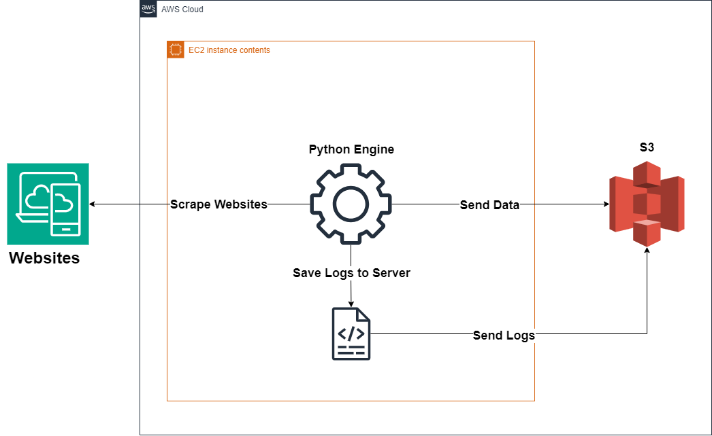

# Web Scraping With AWS

## Introduction
This is a web scraping project that is built using AWS - the goal here is to demonstrate expertise in building a functional Extract Transform Load (ETL) Application on AWS. Hopefully, this project will not cost me an arm and a leg with the AWS bill. 

## Objectives
By the end of this project, the following will have been completed -
1. Create a Python script to scrape product data from the major grocery stores in South Africa. 
2. Scraped data should be processed and then stored in AWS S3.
3. Create detailed logs for the scrapping process and the logs should be stored in AWS S3.
4. Implement scheduler for periodic scraping. 

## Architecture

